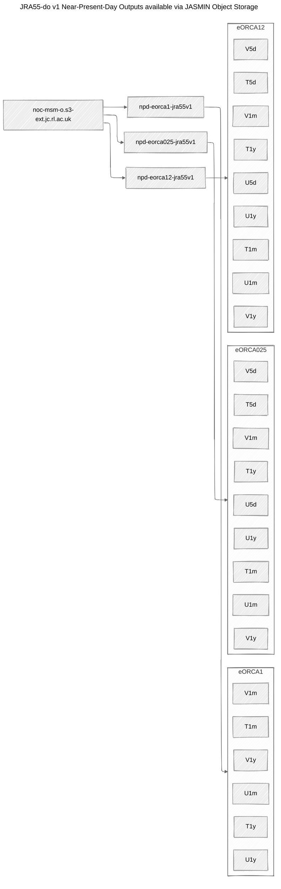
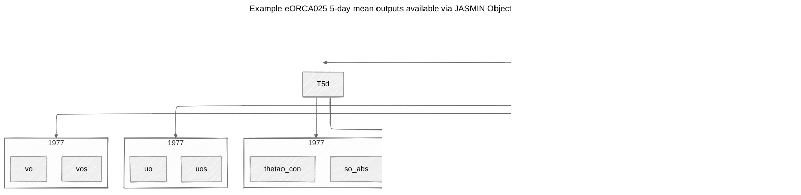

# **Outputs**

!!! abstract "Summary"

    **This page provides information on the ocean & sea-ice outputs made available from the Near-Present-Day simulations at 5-day, monthly and annual frequency & how to access them using the JASMIN Object Store.**

---

## **Primary Outputs**
Primary outputs of the Near-Present-Day simulations are those variables which are calculated online at runtime and are written to netCDF files according to where they are defined on the eORCA grid.

!!! info "Example: eORCA1"
    The conservative temperature ```thetao_con``` averaged at monthly intervals will be stored in the ```eORCA1_1m_YYYYMM_grid_T.nc``` file. 

Below we include a table of the available ocean and sea-ice variables output by each Near-Present-Day simulation:

### **Available Ocean & Sea-Ice Outputs:**

- **ERA-5 Adjusted (1976-present)**

```python {marimo}
import marimo as mo
import pandas as pd
data_era5 = pd.read_csv("https://raw.githubusercontent.com/NOC-MSM/NOC_Near_Present_Day/main/jasmin_os/catalogs/npd_era5_v1_catalog.csv")
mo.ui.table(data_era5, selection=None, page_size=5)
```

- **JRA55-do (1976-2023)**

```python {marimo}
data_jra5 = pd.read_csv("https://raw.githubusercontent.com/NOC-MSM/NOC_Near_Present_Day/main/jasmin_os/catalogs/npd_jra55_v1_catalog.csv")
mo.ui.table(data_jra5, selection=None, page_size=5)
```

---

## **Secondary Outputs**
Secondary outputs of the Near-Present-Day simulations include those diagnostics which are calculated offline using the primary output variables. In many cases, these outputs will be produced during the analysis of the Near-Present-Day simulations, however, a collection of especially popular diagnostics will be made available to users.

### Atlantic Meridional Overturning Circulation Diagnostics

The Atlantic Meridional Overturning Circulation (AMOC) is a fundamental component of the global climate system owing to its role in the redistribution of heat, nutrients and freshwater. On account of its wider societal significance, a number of continuous ocean observing systems have been deployed throughout the Atlantic Ocean to monitor the state and variability of the AMOC.

The [METRIC](https://github.com/oj-tooth/metric) Python package allows users to calculate meridional overturning and heat transport diagnostics in numerical models which are equivalent (and hence comparable) to existing observations at the RAPID (26.5$^{\circ}$N), MOVE (16$^{\circ}$N) and SAMBA (34.5$^{\circ}$S) (see [Danabasoglu et al., 2021](https://doi.org/10.1029/2021GL093045)).

Diagnostics including meridional overturning stream functions and the meridional fluxes of heat and freshwater will be made available as secondary output variables via the [JASMIN Object Store].

[JASMIN Object Store]: outputs.md#using-the-jasmin-object-store

---

## **Accessing Near-Present-Day Data via the JASMIN Object Store.**
To improve the accessibility of the large volumes of data generated by the Near-Present-Day simulations, primary and secondary output variables will be made available via the JASMIN Object Store. For those who are unfamiliar with object storage, we suggest reading the primer below before getting started accessing the available outputs.

### **What is Object Storage?**
Object storage is a fairly modern data storage solution that provides an efficient, scalable and collaborative way to store and manage large volumes of scientific data. 

Although most of us are accustomed to working with traditional hierarchical file systems (think folders and file paths), in object storage data is stored as objects in "buckets" rather than folders. Each object consists of 

1. Data :material-arrow-right: For example, a sea surface temperature dataset.
2. Metadata :material-arrow-right: Descriptive information about the data.
3. Unique Identifier :material-arrow-right: Used to retrieve the object.

Object storage systems have two especially valuable properties for ocean-climate applications:

* **Scalability:** Since object stores employ a flat storage architecture, they can easily handle petabytes - exabytes of data.
* **Accessibility:** Since objects are accessed via Application Programming Interfaces (APIs), users can easily retrieve and analyse data from anywhere over HTTP, with authentication using HTTP headers.

Object stores are generally considered an efficient and cost-effective way to store and access data from the cloud, and are available from all the major cloud service providers (e.g., Amazon Web Services, Azure). 

### **Introduction to the JASMIN Object Store**

JASMIN is the UK's data analysis facility for environmental science, providing storage and compute facilities to enable data-intensive ocean-climate research. One such storage facility is the [JASMIN object store](https://help.jasmin.ac.uk/docs/short-term-project-storage/using-the-jasmin-object-store/). The JASMIN object store is [S3 compatible](https://www.scality.com/topics/what-is-s3-compatible-storage/) for those already familiar with AWS.

The JASMIN object store is organised into tenancies (equivalent to Group Workspaces for those already familiar with JASMIN). Outputs from the Near-Present-Day simulations are stored in the ```noc-msm-o``` tenancy using the following structure:

### **NPD JRA55-do v1**

Outputs available for the Near-Present-Day simulations using the JRA55-do atmospheric forcing dataset (1976-2024) are stored in **Zarr stores** (see below) in the ```npd-eorca1-jra55v1``` and ```npd-eorca025-jra55v1``` buckets, which correspond to the eORCA1 and eORCA025 model configurations, respectively. Each **Zarr store** is accessible (read-only) over HTTP using the URL prefix ```https://noc-msm-o.s3-ext.jc.rl.ac.uk```.



??? info "Note"
    **The URL prefix provided above is for users seeking to access Near-Present-Day outputs from the JASMIN External Cloud and locations external to JASMIN.**
	
	**From inside JASMIN, including LOTUS compute nodes and Scientific Analysis servers the URL prefix** ```https://noc-msm-o.s3.jc.rl.ac.uk``` **can be used.**

Within a given bucket, output data available depends on the chosen model configuration.

For the coarse resolution eORCA1 configuration, output variables, available as monthly and annual means, are stored in 'sub-buckets' (note that, in reality, these are simply prefixes used to identify each variable) determined according to the grid point where the variable is defined. For example, the ```npd-eorca1-jra55v1/T1m``` 'sub-bucket' contains all the monthly-mean output variables stored at T-grid points.

For the finer resolution eORCA025 and eORCA12 configurations, output variables are available as 5-day, monthly and annual means. The monthly and annual mean output variables are stored analogously to the eORCA1 configuration described above. 5-day mean output variables are stored in 'sub-buckets' according to their year and their location on the NEMO model grid. For example, the ```npd-eorca025-jra55v1/T5d/1976``` 'sub-bucket' contains all of the 5-day mean output variables stored at T-grid points during 1976.

For more information on how variables are defined on the eORCA grid, users are referred to the [NEMO documentation](https://www.nemo-ocean.eu).




### **NPD ERA-5 v1**

Outputs available for the Near-Present-Day simulations using a climatologically adjusted version of the ERA-5 atmospheric forcing dataset (1976-present) are stored in **Icechunk repositories** (see below) in the ```npd-eorca1-era5v1```, ```npd-eorca025-era5v1``` and ```npd-eorca12-era5v1``` buckets, which correspond to the eORCA1, eORCA025 and eORCA12 model configurations, respectively.

```mermaid
---
title: ERA-5 v1 Near-Present-Day Outputs available via JASMIN Object Storage
config:
  layout: elk
  look: handDrawn
  theme: neutral
---
graph LR
  subgraph npd-eorca1-era5v1 [eORCA1]
	  eORCA1.T1m[T1m]
	  eORCA1.U1m[U1m]
	  eORCA1.V1m[V1m]
	  eORCA1.W1m[W1m]
	  eORCA1.I1m[I1m]
	  eORCA1.S1m[S1m]
	  eORCA1.T1y[T1y]
	  eORCA1.U1y[U1y]
	  eORCA1.V1y[V1y]
	  eORCA1.W1y[W1y]
	  eORCA1.I1y[I1y]
	  eORCA1.S1y[S1y]
	 end
  subgraph npd-eorca025-era5v1 [eORCA025]
	  eORCA025.T5d_3d[T5d_3d]
	  eORCA025.U5d_3d[U5d_3d]
	  eORCA025.V5d_3d[V5d_3d]
	  eORCA025.T5d_4d[T5d_4d]
	  eORCA025.U5d_4d[U5d_4d]
	  eORCA025.V5d_4d[V5d_4d]
	  eORCA025.W5d_4d[W5d_4d]
	  eORCA025.I5d_3d[I5d_3d]
	  eORCA025.S5d_1d[S5d_1d]
	  eORCA025.T1m_3d[T1m_3d]
	  eORCA025.U1m_3d[U1m_3d]
	  eORCA025.V1m_3d[V1m_3d]
	  eORCA025.T1m_4d[T1m_4d]
	  eORCA025.U1m_4d[U1m_4d]
	  eORCA025.V1m_4d[V1m_4d]
	  eORCA025.W1m_4d[W1m_4d]
	  eORCA025.I1m_3d[U1m_3d]
	  eORCA025.S1m_1d[S1m_1d]
	  eORCA025.T1y_3d[T1y_3d]
	  eORCA025.U1y_3d[U1y_3d]
	  eORCA025.V1y_3d[V1y_3d]
	  eORCA025.T1y_4d[T1y_4d]
	  eORCA025.U1y_4d[U1y_4d]
	  eORCA025.V1y_4d[V1y_4d]
	  eORCA025.W1y_4d[W1y_4d]
	  eORCA025.I1y_3d[I1y_3d]
	  eORCA025.S1y_1d[S1y_1d]
	 end
  subgraph npd-eorca12-era5v1 [eORCA12]
	  eORCA12.T5d_3d[T5d_3d]
	  eORCA12.U5d_3d[U5d_3d]
	  eORCA12.V5d_3d[V5d_3d]
	  eORCA12.T5d_4d[T5d_4d]
	  eORCA12.U5d_4d[U5d_4d]
	  eORCA12.V5d_4d[V5d_4d]
	  eORCA12.W5d_4d[W5d_4d]
	  eORCA12.I5d_3d[I5d_3d]
	  eORCA12.S5d_1d[S5d_1d]
	  eORCA12.T1m_3d[T1m_3d]
	  eORCA12.U1m_3d[U1m_3d]
	  eORCA12.V1m_3d[V1m_3d]
	  eORCA12.T1m_4d[T1m_4d]
	  eORCA12.U1m_4d[U1m_4d]
	  eORCA12.V1m_4d[V1m_4d]
	  eORCA12.W1m_4d[W1m_4d]
	  eORCA12.I1m_3d[U1m_3d]
	  eORCA12.S1m_1d[S1m_1d]
	  eORCA12.T1y_3d[T1y_3d]
	  eORCA12.U1y_3d[U1y_3d]
	  eORCA12.V1y_3d[V1y_3d]
	  eORCA12.T1y_4d[T1y_4d]
	  eORCA12.U1y_4d[U1y_4d]
	  eORCA12.V1y_4d[V1y_4d]
	  eORCA12.W1y_4d[W1y_4d]
	  eORCA12.I1y_3d[I1y_3d]
	  eORCA12.S1y_1d[S1y_1d]
	 end

    A[noc-msm-o.s3-ext.jc.rl.ac.uk] --> B[npd-eorca1-era5v1]
    B --> npd-eorca1-era5v1
    A --> C[npd-eorca025-era5v1]
    C --> npd-eorca025-era5v1
    A --> D[npd-eorca12-era5v1]
    D --> npd-eorca12-era5v1
```



### **Using the JASMIN Object Store**

Now we have seen how the outputs of the Near-Present-Day simulations are structured within the JASMIN object store, our next step is accessing this data from a local or remote machine.

Although many users will be more familiar with analysing ocean-climate data via netCDF files, output variables generated by the Near-Present-Day simulations are stored in Analysis-Ready Cloud-Optimised (ARCO) [Zarr](https://zarr.readthedocs.io/en/stable/index.html) stores and [Icechunk](https://icechunk.io/en/latest/overview/) repositories. 

!!! info "A Brief Introduction to Zarr"
    Zarr is an open source, flexible and efficient storage format designed for chunked, compressed, N-dimensional arrays. At its simplest, Zarr can be considered a cloud-native alternative to netCDF files since it consists of binary data files (chunks) accompanied by external metadata files.

    One important difference between archival file formats (e.g., netCDF) and Zarr is that there is no single Zarr file. Instead, a Zarr store (typically given the suffix .zarr - although this is not a requirement) is a directory containing chunks of data stored in compressed binary files and JSON metadata files containing the array configuration and compression used.

    Zarr works especially well in combination with cloud storage, such as the JASMIN object store, given that users can access data concurrently from multiple threads or processes using Python or a number of other programming languages.

    [Click here](https://zarr-specs.readthedocs.io/en/latest/specs.html) more information on the Zarr specification.

!!! info "A Brief Introduction to Icechunk"
    Icechunk is an open-source, cloud-native transactional tensor storage engine designed for N-dimensional data in cloud object storage. At its simplest, Icechunk can be considered a "transactional storage engine for Zarr", meaning that Icechunk manages all of the I/O for reading, writing and updating metadata and chunk data & keeps track of changes (referred to as transactions) to the store in the form of snapshots. 

    In place of Zarr store, users create an Icechunk repository, which functions as both a self-contained Zarr store and a database of the snapshots resulting from transactions (e.g., updating values or writing new values in the store). 

    This allows Icechunk repositories to support data version control, since users can time-travel to previous snapshots of a repository.

    [Click here](https://icechunk.io/en/latest/overview/) for an overview of Icechunk.

#### Method 1: Accessing Icechunk Repositories using the OceanDataStore library:
The simplest way to access ERA-5 Near-Present-Day simulation outputs is to use the **OceanDataStore** Python library designed to streamline accessing ocean model outputs stored in cloud object storage. To learn more about **OceanDataStore** click [here](https://noc-msm.github.io/OceanDataStore/).

Here, we will provide an example of using the **OceanDataCatalog** API to access outputs from the eORCA1-ERA5v1 Near-Present-Day configuration:

```bash title="Installing OceanDataStore with pip" 
# Create and Activate a new Python virtual environment:
source /path/to/my/venv/bin/activate

# Install OceanDataStore from GitHub:
pip install git+https://github.com/NOC-MSM/OceanDataStore.git

```

Now, in a Python script or Jupyter / Marimo Notebook, we will access the annual mean sea surface temperature ```tos_con``` (1976-present) data:

```py title="Example: Accessing eORCA1-ERA5v1 Sea Surface Temperature via OceanDataCatalog" 
# Import required Python packages:
from OceanDataStore import OceanDataCatalog

# Create instance of OceanDataCatalog to access National Oceanography Centre Spatio-Temporal Access Catalog:
catalog = OceanDataCatalog(catalog_name="noc-model-stac")

# Search for sea surface conservative temperature (SST) outputs:
catalog.search(collection='noc-npd', variable='tos_con')

# Let's access the SST variables first ID, corresponding to the eORCA1 ERA-5v1 simulation as an xarray Dataset:
ds = catalog.open_dataset(id=catalog.Items[0].id,
						  variables=['tos_con'],
                          )
```

#### Method 2a: Accessing Zarr Stores Directly via URL
The simplest way to access JRA55-do v1 Near-Present-Day simulation outputs is to use the URLs included in the **Available Ocean & Sea-Ice Outputs** in combination with [xarray](https://docs.xarray.dev/) - a Python package for working with labelled multi-dimensional arrays. Here, we will provide an example of accessing the annual mean sea surface temperature ```tos_con``` dataset (1976-2023) output by the eORCA1-JRA55v1 Near-Present-Day configuration:

```py title="Example: Accessing eORCA1-JRA55v1 Sea Surface Temperature via URL" 
# Import required Python packages:
import xarray as xr

# Define path to sea surface temperature dataset in the JASMIN object store:
sst_url = "https://noc-msm-o.s3-ext.jc.rl.ac.uk/npd-eorca1-jra55v1/T1y/tos_con"

# Open sea surface conservative temperature (C) dataset with xarray:
tos_con = xr.open_zarr(sst_url, consolidated=True, chunks={}) # (1)
```

1.  :man_raising_hand: Here, ```consolidated=True``` means open the store using zarr’s consolidated metadata capability and ```chunks={}``` means load the data with dask using engine preferred chunks. See the xarray [documentation](https://docs.xarray.dev/en/stable/generated/xarray.open_zarr.html) for more details.
